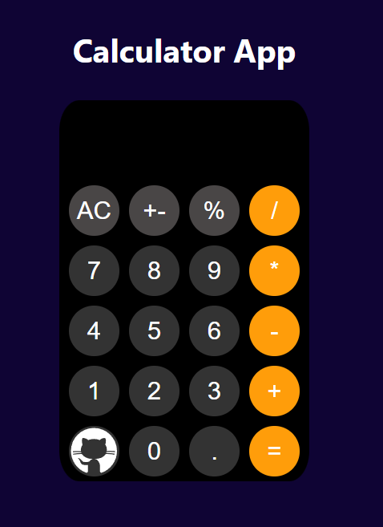

# Simple Calculator App

## Overview
This is a simple calculator web application built using HTML, CSS, and JavaScript. It allows users to perform basic arithmetic operations, including addition, subtraction, multiplication, and division.

## Features
- Basic arithmetic operations: addition, subtraction, multiplication, and division
- Percentage calculation
- Toggle between positive and negative values
- Clear all input (AC button)
- Responsive design

## Technologies Used
- HTML
- CSS
- JavaScript

## Installation
1. Clone this repository:
   ```sh
   git clone https://github.com/yourusername/calculator-app.git
   ```
2. Navigate to the project directory:
   ```sh
   cd calculator-app
   ```
3. Open `index.html` in your browser.

## Usage
- Click on the buttons to input numbers and operations.
- Use `AC` to clear the display.
- Click `=` to evaluate the expression.

## Screenshots

